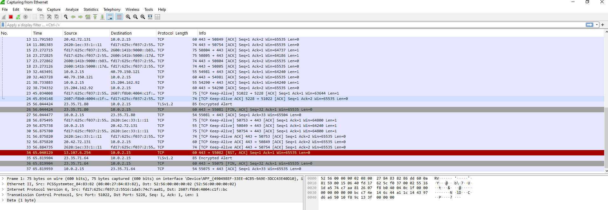
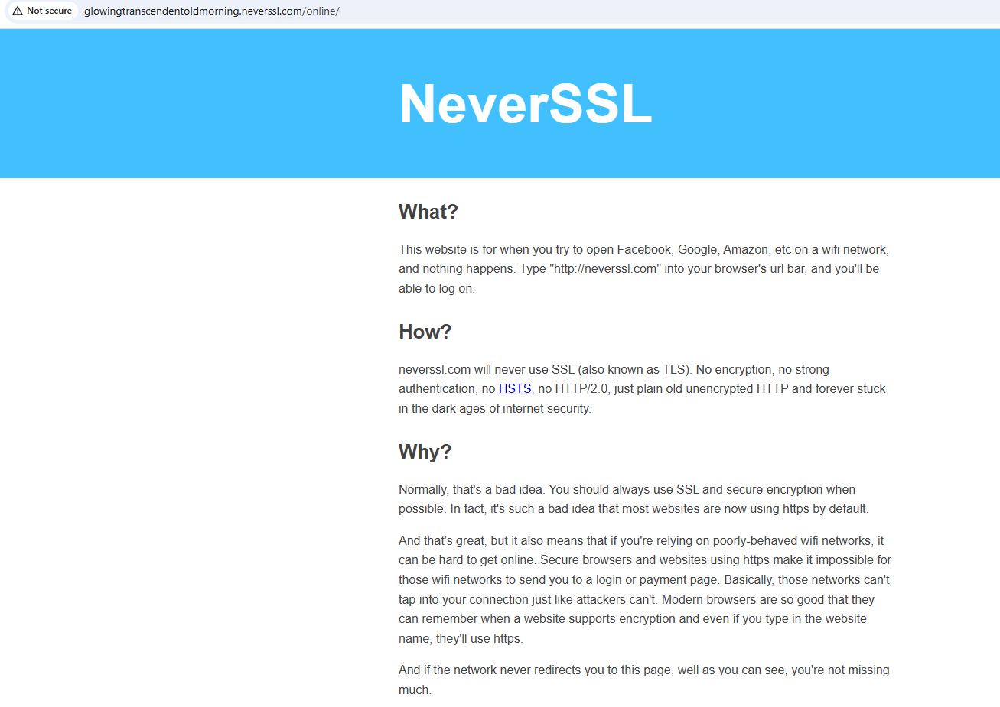
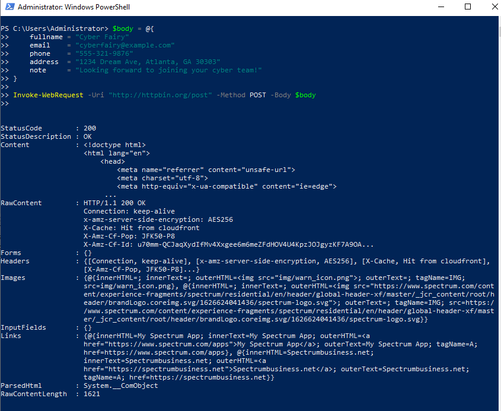
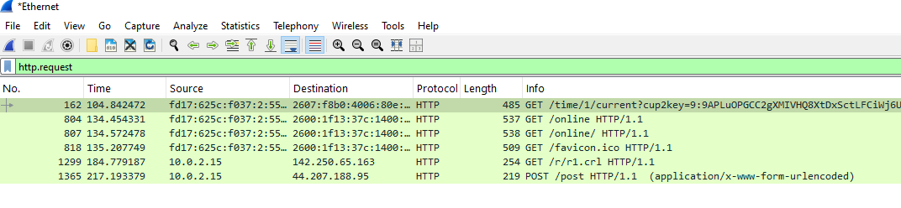
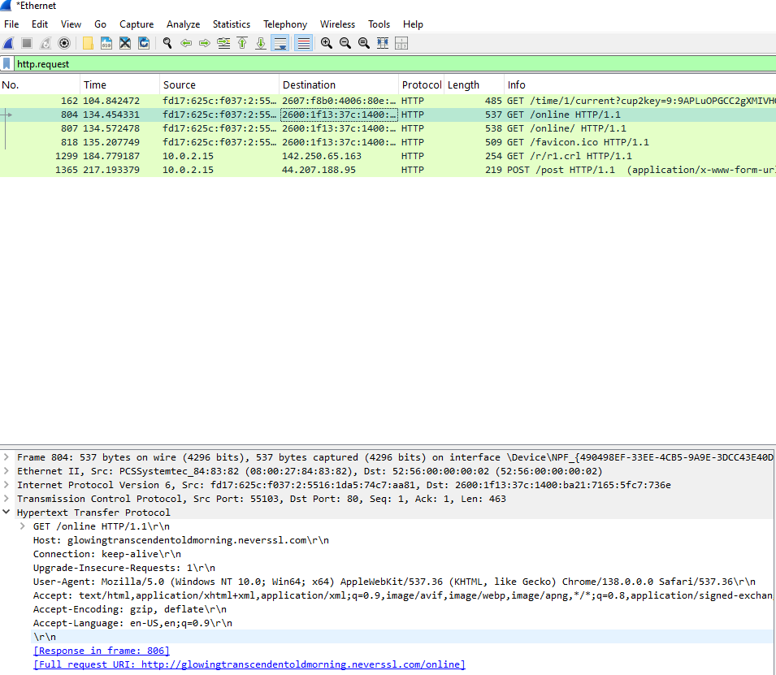
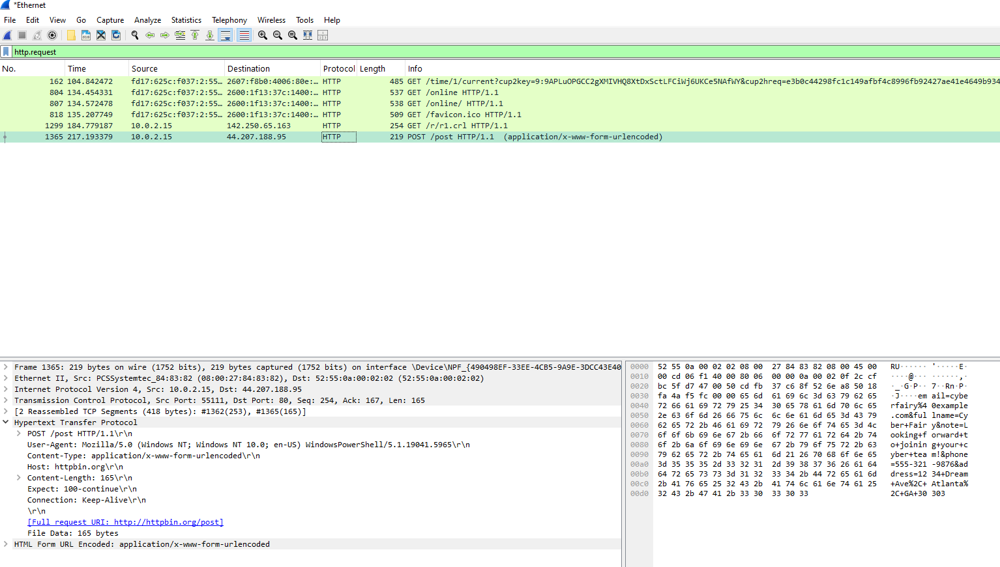
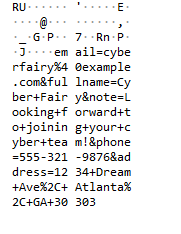

# 🔍 Wireshark Lab: Capturing HTTP GET and POST Requests

## 🌐 Overview

In this lab, I used Wireshark to capture and inspect both an HTTP GET request and an HTTP POST request. Instead of relying on modern websites that use HTTPS, I created traffic that was unencrypted and visible to Wireshark by using tools like PowerShell and known HTTP-only endpoints.

---

## 🧠 Why I Used PowerShell Instead of a Website

Most websites today use HTTPS which encrypts all requests, including form submissions. Wireshark cannot view the body of encrypted traffic. On top of that, many websites block automated POSTs from curl or PowerShell. By using PowerShell to send a manual HTTP POST to httpbin.org, I was able to craft a clean, visible request that Wireshark could analyze.

---

## 🧪 Tools Used

- Wireshark
- PowerShell
- Browser
- http://neverssl.com (for GET)
- http://httpbin.org/post (for POST)

---

## 🪜 Lab Steps

### 1. Started Wireshark and selected the active interface  


---

### 2. Visited http://neverssl.com to trigger a GET request  


---

### 3. Opened PowerShell and sent an HTTP POST request to http://httpbin.org/post

```powershell
$body = @{
    fullname = "Cyber Fairy"
    email    = "cyberfairy@example.com"
    phone    = "555-321-9876"
    address  = "1234 Dream Ave, Atlanta, GA 30303"
    note     = "Looking forward to joining your cyber team!"
}

Invoke-WebRequest -Uri "http://httpbin.org/post" -Method POST -Body $body
```



---

### 4. Stopped Wireshark capture and filtered using `http.request`  


---

### 5. Inspected the GET request packet and reviewed the headers  


---

### 6. Inspected the POST request and expanded the HTTP section  


---

### 7. Viewed the form data in plain text in the ASCII pane  


---

## 🧠 Reflection Q&A

> **Q: Why use http instead of https?**  
> A: HTTPS encrypts everything, so Wireshark can't show you the contents of the request. HTTP traffic is unencrypted and fully visible.

> **Q: Why not just use a form on a website?**  
> A: Most websites block scripts or redirect to HTTPS. PowerShell lets me send the exact POST request I want over HTTP, which Wireshark can analyze.

> **Q: What's the difference between GET and POST?**  
> A: GET sends data in the URL and is often used to request information. POST sends data in the body of the request and is often used to submit forms.

---

## 💻 Bonus: Reusable Template Script

```powershell
$body = @{
    fullname = ""
    email    = ""
    phone    = ""
    address  = ""
    note     = ""
}

Invoke-WebRequest -Uri "http://httpbin.org/post" -Method POST -Body $body
```

Replace the blank fields with your own values before running.

---

## ✅ What I Learned

- GET and POST requests behave differently on the network
- HTTP traffic can be inspected in Wireshark down to the raw form data
- Most websites use HTTPS, which hides this info unless you simulate traffic with tools like PowerShell or curl

---
